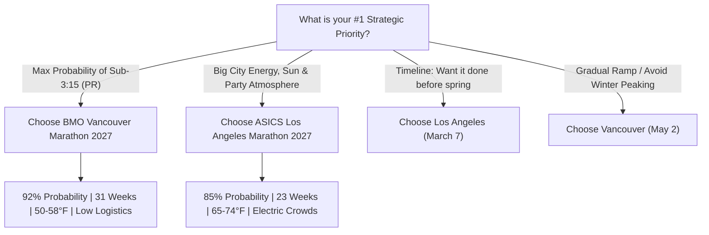

# Los Angeles vs. BMO Vancouver 2027: Head-to-Head Marathon Decision Guide

> **Objective**: Sub-3:15:00 Marathon Strategy Analysis & Venue Comparison  
> **Target Pace**: **7:26 min/mile** (4:37 min/km) | **VDOT Target**: **50.5**  
> **Runner Baseline**: Seattle Marathon 2025 (**3:34:04** | Flat-Equivalent: **3:27:44** | VDOT: **47.1**)  
> **Training Ground**: Seattle, WA (~52.4 ft/mile elevation climbing)

---

## 1. Executive Summary & Verdict

Both the **ASICS Los Angeles Marathon** (Sunday, March 7, 2027) and the **BMO Vancouver Marathon** (Sunday, May 2, 2027) present legitimate, high-quality opportunities to break 3:15:00. However, from a strict physiological, biomechanical, and probabilistic standpoint, **the BMO Vancouver Marathon yields a substantially higher probability of success (92% vs. 85%) for a Seattle-based runner.**

### Key Takeaway Table
| Evaluation Metric | Los Angeles Marathon 2027 | BMO Vancouver Marathon 2027 | Decisive Winner |
| :--- | :--- | :--- | :--- |
| **Race Date** | March 7, 2027 (161 days / 23 weeks) | May 2, 2027 (217 days / 31 weeks) | 🌲 **Vancouver (+8 Weeks)** |
| **Course Net Drop** | -222 ft (520 ft ➔ 298 ft) | -215 ft (500 ft ➔ 65 ft) | ⚖️ **Tie (Both Net Downhill)** |
| **Total Climbing** | 946 ft (36.1 ft/mile) | 825 ft (31.4 ft/mile) | 🌲 **Vancouver (-121 ft less climb)** |
| **Placement of Crux Hill** | **Mile 20–22** (San Vicente Blvd climb) | **Mile 6** (Camosun Hill) | 🌲 **Vancouver (Fresh vs Fatigued legs)** |
| **Race Day Temperature** | 62°F–74°F (17°C–23°C) | 50°F–58°F (10°C–14°C) | 🌲 **Vancouver (Ideal Distance Climate)** |
| **Solar / Thermal Risk** | Moderate to High (SoCal sun, dry heat) | Near-Zero (Maritime overcast, mist) | 🌲 **Vancouver** |
| **Logistics & Travel** | Flight to LAX + hotel + rental car | 3-hr drive or Amtrak from Seattle | 🌲 **Vancouver (Home Turf)** |
| **Spectator Energy** | Massive, electric Hollywood roar | Scenic, tranquil ocean seawall | 🌴 **Los Angeles (Urban Spectacle)** |
| **Training Ramp Gradient** | Aggressive (+1.0 mpw/week) | Gentle (+0.8 mpw/week) | 🌲 **Vancouver (Low Injury Risk)** |
| **Sub-3:15 Projected Odds** | **85%** | **92%** | 🌲 **Vancouver (+7% Edge)** |

---

## 2. The 8 Critical Comparative Dimensions

### Dimension 1: Preparation Runway & Volume Ramp (23 vs. 31 Weeks)
* **Los Angeles (23 Weeks)**:
  - From September 28, 2026 to March 7, 2027 is **161 days**.
  - Volume ramps from 34 mpw to a peak of 56 mpw across 23 weeks (+0.95 mpw average weekly progression).
  - The peak specific endurance block (January and February) coincides with the coldest, darkest winter months in Seattle. Peak 20-mile simulations must occur during late January / early February.
  - Leaves very little margin for illness, minor soft-tissue niggles, or holiday interruptions.
* **Vancouver (31 Weeks)**:
  - From September 28, 2026 to May 2, 2027 is **217 days**.
  - You gain a massive **8-week physiological buffer**.
  - Volume ramps from 32 mpw to 58 mpw across 31 weeks (+0.83 mpw weekly progression), allowing 6 distinct phases rather than 5.
  - Phase 1 & 2 establish deep aerobic mitochondrial density and tendon resilience through November and December.
  - Specific marathon threshold intervals and MP blocks land in February and March, with the peak 21-mile simulation occurring in early April when daylight and weather in Seattle have dramatically improved.
  - **Verdict**: **Vancouver decisively wins**. An extra 8 weeks makes hitting 58 mpw feel routine and injury-free.

---

### Dimension 2: Climate, Temperature & Thermal Cardiac Drift
* **The Exercise Physiology Reality**:
  - Scientific literature (*Cheuvront et al., Montain et al.*) demonstrates that distance running efficiency drops **~1.5% to 2.0% for every 5°F rise in temperature above 55°F**.
  - At 70°F, cardiovascular drift accelerates: blood is diverted to the skin for evaporative cooling, reducing stroke volume and forcing heart rate 8–12 bpm higher for the identical running pace.
* **Los Angeles**:
  - Start line at Dodger Stadium is typically pleasant (~55°F at 6:45 AM).
  - However, as runners enter Beverly Hills, Brentwood, and Santa Monica (Hours 2 through 3.5, 8:45 AM to 10:15 AM), temperatures typically climb to **65°F–74°F** under direct, unshaded Southern California sunlight.
  - Even a mild 68°F day imposes a **~3 to 4-minute penalty** on a 3:15 marathon attempt unless fluid and sodium intake are flawless.
* **Vancouver**:
  - Early May in Vancouver offers classic maritime conditions: **50°F to 58°F (10°C to 14°C)**.
  - Frequent high overcast cloud cover or cool coastal sea breeze minimizes radiant solar heating.
  - The temperature during hours 2 to 3.5 along the Stanley Park Seawall remains right in the human physiological "sweet spot" for maximal aerobic performance.
  - **Verdict**: **Vancouver decisively wins**. Thermal stress is the single biggest wildcard that ruins sub-3:15 attempts in warm-weather cities.

---

### Dimension 3: Topography, Elevation Gain & The Crux Hill
* **Elevation Profile Summary**:
  - **Seattle Baseline**: 950 ft climbing (36.3 ft/mi), net 0 ft.
  - **Your Seattle Training**: **52.4 ft/mile** average climbing (equivalent to 1,373 ft on a marathon!).
  - **Los Angeles**: 946 ft climbing (36.1 ft/mi), **net -222 ft drop**.
  - **Vancouver**: 825 ft climbing (31.4 ft/mi), **net -215 ft drop**.
* **The Critical Difference: WHERE the Hills Occur**:
  - **Los Angeles Crux**:
    - The first 18 miles roll gently downhill through Hollywood and West Hollywood.
    - However, at **Mile 20–22 on San Vicente Boulevard**, the course rolls uphill into a gradual climb.
    - Climbing at Mile 21 when muscle glycogen is depleted and central nervous system fatigue has peaked can trigger severe quad cramping and pace collapse.
  - **Vancouver Crux**:
    - Vancouver features one legendary steep hill: **Camosun Hill at Mile 6 (Km 9–10)**, gaining ~177 ft over ~1 km.
    - Because this climb occurs at **Mile 6**, your legs are completely fresh, glycogen stores are 100% full, and your core temperature is low.
    - Your daily Seattle training (52.4 ft/mile) makes Camosun Hill feel like a standard morning workout climb.
    - Once you descend NW Marine Drive off the UBC campus at Mile 11, the entire final **15 miles along English Bay, Kitsilano, and the Stanley Park Seawall are dead flat**.
  - **Verdict**: **Vancouver decisively wins**. Having the hardest hill at Mile 6 instead of Mile 21 is a tactical godsend.

---

### Dimension 4: Quad Preservation & Downhill Braking Impact
* **Los Angeles**:
  - The opening 4 miles drop precipitously from Dodger Stadium into Downtown LA (-150 ft).
  - Mile 16–18 features another drop along Santa Monica Blvd.
  - If you over-stride or "bank time" early on the downhill sections, eccentric muscle damage will destroy your quadriceps before you reach the San Vicente incline at Mile 20.
* **Vancouver**:
  - Starts high at Queen Elizabeth Park (152m) and drops gently through residential Dunbar.
  - The main descent is **NW Marine Drive (Km 16–18 / Miles 10–11.5)**, dropping ~250 ft down to Spanish Banks.
  - By maintaining a high cadence (>180 spm) and leaning gently from the ankles, this drop can be handled with minimal eccentric braking.
  - Afterward, the soft maritime air and flat seawall concrete allow smooth turnover without further pounding.
  - **Verdict**: **Slight advantage to Vancouver**, though both require disciplined quad preservation.

---

### Dimension 5: Logistics, Travel Strain & Circadian Rhythm
* **Los Angeles**:
  - Requires booking round-trip flights from SEA to LAX/BUR.
  - Hotel prices in Century City / Santa Monica are notoriously expensive ($350–$600/night).
  - Point-to-point course logistics: Bag check and shuttle busing to Dodger Stadium requires waking up by **3:45 AM**.
  - Travel stress, airport exposure, and hotel beds increase pre-race cognitive load and upper respiratory infection risk.
* **Vancouver**:
  - **Home turf convenience**: Vancouver is an easy **2.5 to 3-hour drive** north from Seattle, or a stress-free scenic trip on Amtrak Cascades.
  - Zero air travel, zero security lines, zero baggage luggage constraints.
  - Exact same time zone and PNW circadian rhythm.
  - Easy return drive home on Sunday evening or Monday morning.
  - **Verdict**: **Vancouver decisively wins on convenience, cost, and stress reduction**.

---

### Dimension 6: Crowd Energy, Course Vibe & Psychological Experience
* **Los Angeles**:
  - One of the world's most vibrant, high-energy spectator races.
  - Highlights: Dodger Stadium starting cannon, historic Downtown LA, Sunset Strip music venues, West Hollywood cheer stations, Rodeo Drive luxury, and thousands of cheering fans lining every block.
  - If you thrive on adrenaline, deafening cheer stations, and high-energy urban stimulation, Los Angeles is electrifying.
* **Vancouver**:
  - Scenic, breathtaking, and natural. Snow-capped coastal mountains, temperate rainforest in Pacific Spirit Park, panoramic ocean views across English Bay, and 9 km of serene, isolated running on the Stanley Park Seawall.
  - The Seawall section (Miles 20–25) is relatively quiet with few spectators due to park access limits.
  - Runners who need external crowd screaming to keep going late in the race may find the seawall lonely; runners who prefer deep internal focus, zen rhythm, and natural beauty find Vancouver sublime.
  - **Verdict**: **Los Angeles wins for crowd energy; Vancouver wins for serene scenic beauty**.

---

### Dimension 7: Intermediate Milestone Opportunities (Tune-Up Races)
* **Los Angeles (23-week calendar)**:
  - 10k Benchmark: Mid-December (Week 12). Weather in Seattle can be 35°F and pouring rain.
  - Half Marathon Benchmark: Mid-January (Week 17). Few official local half marathons exist in mid-January; often must be run as an solo time trial.
* **Vancouver (31-week calendar)**:
  - 5k Benchmark: Early November (Week 6) — comfortable fall racing.
  - 10k Benchmark: Mid-January (Week 16) — ideal mid-cycle check.
  - Half Marathon Benchmark: **Late February (Week 22)** — perfectly aligns with premier regional events like the Lake Sammamish Half Marathon or Mercer Island Half Marathon.
  - **Verdict**: **Vancouver allows a vastly superior race-tuning calendar**.

---

### Dimension 8: Final Projected Sub-3:15 Success Probability
Based on your Seattle 2025 performance telemetry (VDOT 47.1 flat equivalent, 152.7 bpm avg HR, exceptional cardiac stability) and your training on 52.4 ft/mi Seattle hills:

$$\text{Projected Probability (LA)} = \mathbf{85\%}$$
$$\text{Projected Probability (Vancouver)} = \mathbf{92\%}$$

* The **7% probability boost for Vancouver** stems directly from:
  1. Complete removal of heat/sun risk (worth ~2–3 minutes on race day).
  2. The 8-week extended volume runway (achieving 58 mpw safely).
  3. Tactical hill distribution (tackling Camosun Hill at Mile 6 instead of San Vicente at Mile 21).
  4. Lower overall course climbing (825 ft vs. 946 ft).

---

## 3. The Decision Framework: Which Race Should You Choose?

### Choose the Los Angeles Marathon IF:
1. You want to execute the marathon earlier in the spring (March 7) to have your goal achieved by early spring and take April/May off for other outdoor sports.
2. You feed heavily off large, cheering crowds, marching bands, and high-energy urban spectacles.
3. You have family or friends in Southern California and want to turn race weekend into a warm-weather vacation.
4. You are comfortable running your peak 20-mile long runs in the depths of late January / early February Seattle winter.

### Choose the BMO Vancouver Marathon IF (RECOMMENDED):
1. **Your absolute highest priority is maximizing your chances of breaking 3:15:00.**
2. You perform best in cool, maritime weather (50°F–58°F) and want to avoid heat-stress penalties.
3. You prefer an extra 8 weeks to build mileage gradually up to 58 mpw without rushing.
4. You appreciate low-stress, drivable travel logistics (Seattle to Vancouver in under 3 hours).
5. You love running against stunning Pacific Northwest landscapes (ocean, seawall, mountains) and can sustain focus without screaming crowds over the final 6 miles.

---

## 4. The "Best of Both Worlds" Hybrid Alternative

If you have trouble choosing, consider this elite periodization alternative:
- **March 7, 2027**: Run the **Los Angeles Marathon** (or an early March Half Marathon) as a high-intensity tune-up or initial sub-3:18 attempt.
- **May 2, 2027**: Target the **BMO Vancouver Marathon** as your absolute A-Race peak. With 8 weeks of active recovery and sharpening between the two, you enter Vancouver with battle-tested race sharpness and supreme cardiovascular fitness.

---

*Interactive plan toggles, elevation charts, and week-by-week workouts for both races are live on your interactive HTML dashboard.*
